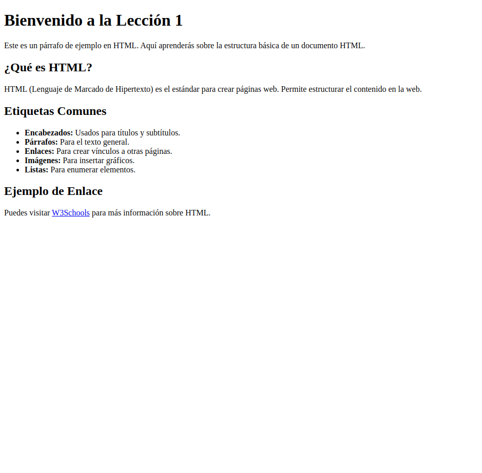

# Lección 1: Estructura HTML

## Descripción General

En esta lección, aprenderás sobre la estructura básica de un documento HTML y cómo crear una página web simple. Se abordarán las etiquetas esenciales y se proporcionará una comprensión clara de cómo se organiza un documento HTML.

## Objetivos de la Lección

- Comprender el propósito de HTML y su papel en el desarrollo web.
- Identificar la estructura básica de un documento HTML.
- Conocer las etiquetas HTML comunes y su uso.
- Crear una página web HTML simple.

## Contenido

1. **Introducción a HTML**: Qué es HTML y por qué es importante.
2. **Estructura Básica de un Documento HTML**: Aprender sobre las etiquetas `<!DOCTYPE html>`, `<html>`, `<head>`, y `<body>`.
3. **Actividad Práctica**: Crear una página web HTML simple.

### 1. Introducción a HTML

HTML, que significa "Lenguaje de Marcado de Hipertexto" (Hypertext Markup Language en inglés), es el estándar fundamental para la creación de páginas web. Se utiliza para estructurar el contenido en la web, permitiendo a los desarrolladores organizar textos, imágenes, enlaces y otros elementos de manera lógica y coherente.

#### ¿Por qué es importante HTML?

- **Estructuración del contenido**: HTML proporciona la estructura básica que permite organizar el contenido en secciones, párrafos y listas, lo que mejora la legibilidad y la accesibilidad.
- **Interoperabilidad**: Todos los navegadores web son capaces de interpretar HTML, lo que garantiza que las páginas web se muestren de manera similar en diferentes dispositivos y plataformas.
- **SEO (Optimización para Motores de Búsqueda)**: Una correcta utilización de HTML permite a los motores de búsqueda indexar el contenido de manera efectiva, lo que puede mejorar la visibilidad de una página en los resultados de búsqueda.
- **Fundamento para otros lenguajes**: HTML es la base sobre la que se construyen otros lenguajes y tecnologías web, como CSS (para el estilo) y JavaScript (para la interactividad), por lo que es esencial para cualquier persona interesada en el desarrollo web.

En resumen, HTML es una herramienta crucial para el desarrollo web, y entenderlo es el primer paso para crear sitios web atractivos y funcionales.

### Explicación de la Declaración HTML y Etiquetas Principales

1. **Declaración HTML (`<!DOCTYPE html>`)**:

   - La declaración `<!DOCTYPE html>` es la primera línea de un documento HTML y le indica al navegador que el documento está escrito en HTML5. Esta declaración no es una etiqueta HTML en sí misma, sino una instrucción que ayuda a los navegadores a interpretar correctamente el contenido de la página.

2. **Etiqueta `<html>`**:

   - La etiqueta `<html>` es el contenedor principal de todo el contenido de la página web. Esta etiqueta indica el inicio de un documento HTML y debe cerrarse con `</html>`. También puede incluir un atributo `lang` para especificar el idioma del contenido, como `lang="es"` para español.

3. **Etiqueta `<head>`**:

   - La etiqueta `<head>` contiene metadatos sobre el documento, que son datos que no se muestran directamente en la página, pero que son importantes para el navegador y los motores de búsqueda. Dentro del `<head>`, se pueden incluir:
     - **Título de la página (`<title>`)**: Define el título que aparecerá en la pestaña del navegador.
     - **Metadatos (`<meta>`)**: Proporcionan información sobre el documento, como la codificación de caracteres (`<meta charset="UTF-8">`) y la configuración de la vista (`<meta name="viewport" content="width=device-width, initial-scale=1.0">`), que es esencial para hacer que las páginas sean responsivas en dispositivos móviles.

4. **Etiqueta `<body>`**:
   - La etiqueta `<body>` contiene todo el contenido visible de la página web, es decir, lo que los usuarios ven en el navegador. Esto incluye textos, imágenes, enlaces, formularios, y cualquier otro tipo de contenido que se desee mostrar. La etiqueta `<body>` debe cerrarse con `</body>`. Todo lo que esté dentro de esta etiqueta es lo que se renderiza en la ventana del navegador.

### Estructura Básica de un Documento HTML

```html
<!DOCTYPE html>
<html lang="es">
  <head>
    <meta charset="UTF-8" />
    <meta name="viewport" content="width=device-width, initial-scale=1.0" />
    <title>Título de la Página</title>
  </head>
  <body>
    <!-- Contenido del cuerpo aquí -->
  </body>
</html>
```

#### Actividad Práctica

Empieza agregando al `<body>` de tu página las siguientes etiquetas `<h1>` y `<h2>` con sus respectivas etiquetas `<p>`

### Agrega la etiqueta `<h1>`:

Incluye una etiqueta `<h1>` con el texto "Bienvenido a la Lección 1".

```html
<h1>Bienvenido a la Lección 1</h1>
<p>
  Este es un párrafo de ejemplo en HTML. Aquí aprenderás sobre la estructura
  básica de un documento HTML.
</p>
```

```html
<h2>¿Qué es HTML?</h2>
<p>
  HTML (Lenguaje de Marcado de Hipertexto) es el estándar para crear páginas
  web. Permite estructurar el contenido en la web.
</p>
```

### Completa el resto del documento:

Crea un nuevo archivo `index.html` dentro de la carpeta `entrega` y rellena el contenido de los párrafos, la lista y el enlace utilizando la captura de pantalla que se proporciona como guía.

Cuando hayas creado tu documento, busca el botón **Go Live** en la parte inferior derecha de Visual Studio Code y observa cómo tu archivo va cambiando a medida que añades nuevas etiquetas.

Usa la imagen proporcionada como referencia. **Busca en `recursos/referencias.md`** las etiquetas que te faltan por añadir si tienes dudas de como se escriben.



Incluye las siguientes etiquetas:

- **Párrafos (`<p>`)**:
  - Un párrafo que explique qué es HTML.
  - Un párrafo que introduzca el tema de las etiquetas comunes.
- **Lista no ordenada (`<ul>`)**:
  - Incluye elementos de la lista sobre las etiquetas comunes, utilizando la etiqueta `<li>` para cada elemento.
- **Enlace (`<a>`)**:
  - Un enlace a "W3Schools" que incluya el texto correspondiente.
